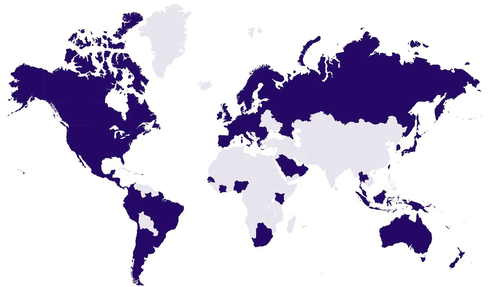

# Sigfox, réseau 0G

## Sigfox en quelques mots

Sigfox est le nom de l'entreprise, mais également le nom de la technologie radio que l'entreprise a inventé.
L'entreprise Sigfox opère son propre réseau global basé sur ce protocol radio.

Le réseau Sigfox est un réseau LPWAN:

- basse consommation,
- bas débit,
- longue portée

C'est aussi une technologie peu couteuse (hardware, licence, et dans la simplicité de dévellopement)

### Fonctionnement

### Communication bidirectionnelle

Sigfox offre une communication bidirectionnelle.

- Uplink - de l'objet vers le cloud
- Downlink - du cloud vers l'objet

Les communications (Uplink et Downlink) sont uniquement initiés par l'objet et non par le cloud. Si le cloud souhaite envoyé une donnée un objet, le cloud doit attendre que l'objet initialise la communication.

### Couverture Sigfox

Sigfox est en cours de déploiement dans plus de 70 pays (Janvier 2020). En Europe de l'ouest, la couverture est très bonne. Dans tous les autres pays, la couverture est partielle, mais le réseau se déploie rapidement.

Sigfox est un réseau global, c'est un réseau unique partout dans le monde. Il n'y a pas de notion de roaming.

 
*Pays avec une couverture Sigfox janvier 2020 (source et plus d'infos: https://www.sigfox.com/en/coverage)*

## Let's play

### 

### 

